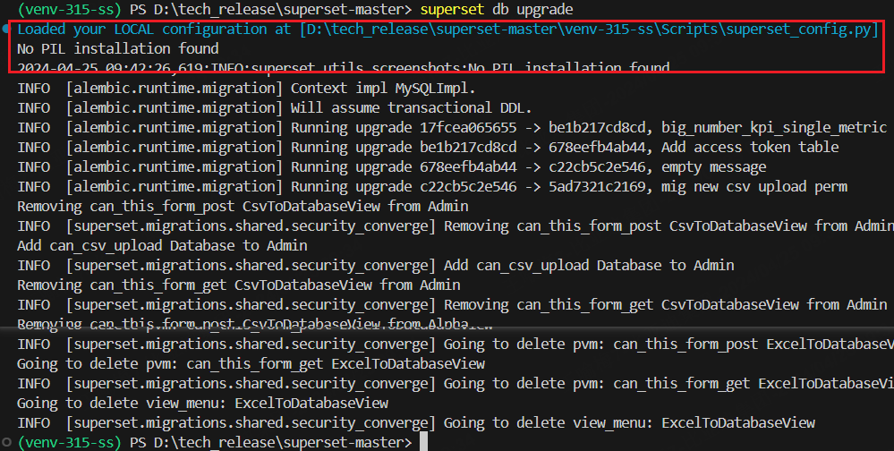
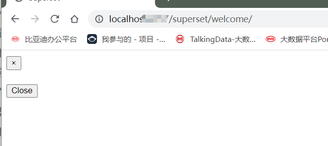

# 1 安装python==3.11.5版本

# 2 vscode配置python解释器

下载vscode python插件，

并选择从vsix安装：
到此应该是配置好python环境了，如果是在terminal中输入python，可以确认现在的路径是否是刚才安装的路径。如果还不能运行python命令，则重启vscode。
 

# 3 vscode配置python虚拟环境

在Visual Studio Code (VSCode) 中配置 Python 虚拟环境，你需要安装 Python 和 pip，然后使用 pip 安装 virtualenv 或者 pyenv。以下是简单的步骤和示例代码：

1. 安装 Python 和 pip：

- Windows: 访问 Python 官网下载安装程序。
- macOS: 使用 Homebrew 安装 brew install python3 和 pip3。
- Linux: 使用包管理器安装 Python 3 和 pip（如 sudo apt-get install python3-pip）。

2. 创建一个新的虚拟环境：

```powershell
# 使用 virtualenv
python -m venv venv-315-ss
# 使用 pyenv
pyenv virtualenv 3.x.x myenv
```

3. 激活虚拟环境：

```powershell
# 使用 virtualenv
.venv-315-ss\Scripts\Activate.ps1
# 使用 pyenv
pyenv activate myenv
```


4. 在 VSCode 中选择虚拟环境：
打开 VSCode，然后打开命令面板（Ctrl+Shift+P 或 Cmd+Shift+P）。
输入 Python: Select Interpreter，然后选择你的虚拟环境。
配置 settings.json 以自动激活虚拟环境：
在 VSCode 中，打开 settings.json 文件（点击左下角的设置图标，选择“设置”，然后点击“工作区设置”）。
添加以下配置：
"python.autoComplete.addBrackets": true,
"python.analysis.extraPaths": ["${workspaceFolder}/${venvFolders}/Lib/site-packages"]

以上步骤和配置足以在 VSCode 中配置 Python 虚拟环境。记得在项目的工作区中安装所需的包，并在 settings.json 中添加你的虚拟环境路径，以便 VSCode 可以正确地识别和使用它。

# 4 安装所需的包

```powershell
[下载源码](https://github.com/apache/superset)
# 离线安装所有依赖
新建一个目录：whls
cd whls
pip downloads apache-superset
pip install --no-index --find-links=file:///home/user/packages/ example_package
或者在whls路径下：
pip install --no-index --find-links=. apache-superset-4.0.0.tar.gz
或者在其它路径下(不好使)：
pip install --no-index --find-links="file:///D:/whls/" apache-superset-4.0.0.tar.gz
# 升级pip
python.exe -m pip install --upgrade pip
# 配置PIP国内源
[[#4 pip 源配置]]
# 在线安装所有依赖
pip install apache-superset
# 在根目录运行命令，部署本地可编辑的开发环境。最后的点表示当前目录
pip install -e .
```

# 5 自定义配置superset_config.py文件

## 5.1 初始化数据库

superset db upgrade
报错：找不到配置文件，而且可以看见找的路径不对
![[analysis/images/Pasted image 20240425092207.png]]
为何会找这个路径呢，先查一下环境变量，果然发现是环境变量的问题。因为之前设置过
![[analysis/images/Pasted image 20240425092254.png]]
是不是和错误的路径一模一样，那么需要修改为当前项目真实的路径即可。
修改或添加如下两个环境变量即可。
![[analysis/images/Pasted image 20240425092707.png]]
![[analysis/images/Pasted image 20240425092431.png]]
重新运行初始化数据库命令，如何还是一样的错误，请重启vscode，再次运行。

## 5.2 没有安装 MySQLdb

ModuleNotFoundError: No module named 'MySQLdb'
其实安装的是 Flask_MySQLdb， 它的依赖

> Flask_MySQLdb Flask mysqlclient blinker click itsdangerous Jinja2 Werkzeug MarkupSafe colorama

可以在线和离线两种方式安装 **Flask_MySQLdb**

```powershell
# 离线方式
pip download Flask_MySQLdb
pip install .\Flask_MySQLdb-2.0.0-py3-none-any.whl .\mysqlclient-2.2.4-cp311-cp311-win_amd64.whl
# 在线方式
pip install Flask_MySQLdb
```

在配置文件中一定要配置 SECRET_KEY  [[#5 说明：SECRET_KEY 如何配置]]

## 5.3 再次回到superset的根目录，运行 superset db upgrade


已经成功加载配置文件，且初始化成功。
在这一步后面，其实我没有设置环境变量，运行是ok。

### 5.3.1 其它初始命令


### 5.3.2 superset fab create-admin

报错没有安装 PIL。
pip install pillow
或者
pip download  pillow
pip install pillow-10.3.0-cp311-cp311-win_amd64.whl

### 5.3.3 加载示例库：superset load_examples

会有一个警告：

> [!NOTE]
> superset\commands\importers\v1\utils.py:132: SAWarning: TypeDecorator EncryptedType() will not produce a cache key because the ``cache_ok`` attribute is not set to True.  This can have significant performance implications including some performance degradations in comparison to prior SQLAlchemy versions.  Set this attribute to True if this type object's state is safe to use in a cache key, or False to disable this warning. (Background on this error at: https://sqlalche.me/e/14/cprf)
> ).all()
> 意思是缓存设置 cache_ok 没有配置为 True, 会影响性能。这个后面再看一下怎么解决，但目前不影响。

### 5.3.4 创建默认角色和权限

superset init

### 5.3.5 在开发环境运行

superset run -h localhost -p 8888 --with-threads --reload --debugger
上面的-h, -p 可以省略，而且值可以替换

### 5.3.6 无法加载官方示例

因为在无网环境，所以无法访问GitHub。
错误：
找到错误文件和 BASE_URL路径： 改这里就可以了。[[#6.10 示例库加载说明]]
修改方法：

- 根据提供的路径去下载离线包，放到superset的根目录下。
- 用一个简单的 http 服务试着访问一下，如果能访问成功，则ok。
- 修改前后对比，方法可以参考后面的说明
  

### 5.3.7 无法正常显示登陆后页面

其实这里没有像预期那样登录后看见示例库，结果看见的welcome界面是：如此的丑陋。

File "D:\tech_release\superset-master\venv-315-ss\Lib\site-packages\werkzeug\utils.py", line 574, in send_from_directory
raise NotFound()
2024-04-25 11:17:45,431:INFO:werkzeug:127.0.0.1 - - [25/Apr/2024 11:17:45] "GET /static/assets/images/loading.gif HTTP/1.1" 404 -
查看了路径没有问题，但就是加载不了。因为自己是二装，所以想到有可能是不匹配，所以全部重装，奇迹就出现了，一切正常了。[[#6.7 pip 强制重装]]

# 6 补充说明：

## 6.1 pip 源配置

> 在Python中，使用pip时可以配置不同的源以加快下载速度或者访问某些源更便利。以下是如何配置pip源的方法：
>
> 命令行临时使用：
>
> pip install -i https://pypi.tuna.tsinghua.edu.cn/simple some-package
> 永久配置，创建或修改 ~/.pip/pip.conf (Unix系统) 或 %APPDATA%\pip\pip.ini (Windows系统)，加入以下内容：
> 命令行永久使用：
> pip config set global.index-url https://mirrors.aliyun.com/pypi/simple/
> 这条命令会设置全局的pip配置，将默认的包索引(index)更改为阿里云的地址。
> 如果你只想为当前用户配置pip源，可以去掉global.，如下：
> pip config set index-url https://mirrors.aliyun.com/pypi/simple/
> [global]
> index-url = https://pypi.tuna.tsinghua.edu.cn/simple
> 环境变量：
>
> 在环境变量中设置 PIP_INDEX_URL:
>
> export PIP_INDEX_URL=https://pypi.tuna.tsinghua.edu.cn/simple
> 使用pip.conf或pip.ini文件配置：
>
> 在Windows系统中，可以在pip目录下创建pip.ini文件，在Unix系统中，可以在~/.pip/pip.conf中进行配置。
>
> 以清华大学的源为例，pip.conf文件内容如下：
>
> [global]
> index-url = https://pypi.tuna.tsinghua.edu.cn/simple
> 保存后，pip将会默认使用这个源进行包的安装。
>
> 常用的国内源包括：
>
> 中国科技大学：https://pypi.mirrors.ustc.edu.cn/simple/
>
> 阿里巴巴：https://mirrors.aliyun.com/pypi/simple/
>
> 豆瓣(douban)：http://pypi.douban.com/simple/
>
> 清华大学：https://pypi.tuna.tsinghua.edu.cn/simple/
>
> 根据网络条件和需求，选择合适的源以提高pip的使用效率。

## 6.2 pip find-links windows路径怎么写

> 在Windows系统中，使用pip的find-links选项时，你需要提供一个本地文件系统上的路径。路径可以是绝对的，也可以是相对的。如果路径中包含空格，需要使用引号将整个路径括起来。以下是一些示例：
>
> 绝对路径（例如C:\my_packages）:
>
> pip install --find-links="C:\my_packages" some_package
> 相对路径（例如.\packages，其中.代表当前目录）:
>
> pip install --find-links=".\packages" some_package
> 如果路径包含空格（例如C:\Program Files\my_packages）:
>
> pip install --find-links="C:\Program Files\my_packages" some_package
> 确保提供的路径指向一个包含.whl文件或者是包含--no-index选项的本地PyPI服务器的目录。

## 6.3 说明：pip find-links powershell路径怎么写

> pip find-links 命令用于在本地或者在网络上的一个路径里查找并安装Python包。如果你需要指定一个PowerShell路径，你可以直接按照标准的文件路径格式来书写。
>
> 在Windows系统中，PowerShell的路径通常遵循以下格式：
>
> FileSystem::\\path\\to\\your\\package
> 例如，如果你有一个包在 C:\Users\YourName\packages 目录下，你可以这样使用 pip find-links：
>
> pip install --find-links=file:///C:/Users/YourName/packages/ some-package
> 请注意，路径中的斜杠是正斜杠（/），并且由于是在Windows系统中，所以需要使用三个斜线（:///）来表示文件协议。
>
> 如果你是在PowerShell中执行这个命令，你可以使用以下格式：
>
> pip install --find-links="file:///C:/Users/YourName/packages/" some-package
> 在这里，双引号用于确保路径中的空格不会被解释为命令的一部分。

## 6.4 说明：pip find-links 路径怎么写

> pip find-links 命令用于在本地或者在网络上的一个路径中查找并安装Python包。你可以使用这个命令来安装本地的包，或者从一个在线的存档中安装包。
>
> 你需要提供一个或多个路径，路径可以是本地的文件系统路径，也可以是URL。
>
> 本地文件系统路径：
>
> pip install --find-links=file:///path/to/packages my_package
> 或者简写为：
>
> pip install -f file:///path/to/packages my_package
> URL路径：
>
> pip install --find-links=http://example.com/packages my_package
> 或者简写为：
>
> pip install -f http://example.com/packages my_package
> 在这些路径中，my_package 是你想要安装的包的名称。路径可以是单个路径，也可以是多个路径，多个路径之间用空格隔开。
>
> 注意，如果你提供的是一个本地路径，它必须是一个有效的文件系统路径，并且这个路径下应该包含你想要安装的包的.whl文件或者是包含这些包的.tar.gz文件。如果你提供的是一个URL，那么这个URL必须是可访问的，并且这个URL指向的资源应该包含你想要安装的包的.whl文件或者是包含这些包的.tar.gz文件。

## 6.5 说明：SECRET_KEY 如何配置

> [!TIP]
> import OpenSSL.crypto as crypto
> from base64 import b64encode
> # 创建RSA密钥对
> key = crypto.PKey()
> key.generate_key(crypto.TYPE_RSA, 1024)
> # 获取公钥并转换为PEM格式字符串
> public_pem = crypto.dump_publickey(crypto.FILETYPE_PEM, key).decode('utf-8')
> # Base64编码公钥
> encoded_pubkey = b64encode(public_pem.encode()).decode().replace('\n', '')[:42]
> print("生成的Base64编码（长度为42）：", encoded_pubkey)

## 6.6 powershell 环境变量命令

- 删除环境变量
  Clear-Item env:TestVariable
- 设置环境变量
  $env:TestVariable=Vaule
- 设置用户范围内的环境变量
  [Environment]::SetEnvironmentVariable("EnvVarName", "EnvVarValue", "User")
- 设置系统范围内的环境变量
  [Environment]::SetEnvironmentVariable("EnvVarName", "EnvVarValue", "Machine")
- 设置进程范围内的环境变量
  $env:EnvVarName = "EnvVarValue"

## 6.7 pip 强制重装

pip install --force-reinstall apache-superset Flask_MySQLdb pillow
pip install --force-reinstall -e .

## 6.8 完整的安装命令

```powershell
第一次安装不用加参数 **--force-reinstall**
pip install --force-reinstall apache-superset Flask_MySQLdb pillow
pip install --force-reinstall -e .
superset db upgrade
superset fab create-admin
superset load_examples
superset init
superset run -h localhost -p 8888 --with-threads --reload --debugger
```

## 6.9 项目路径说明


## 6.10 示例库加载说明

去helpers.py中提供的GitHub路径下载示例库，然后解压到项目的根目录下。
在superset的根目录下运行：
python -m http.server 8080
在浏览器中输入：
http://localhost:8080
应该可以看见文件列表，再把路径输入到 BASE_URL中，就ok。
