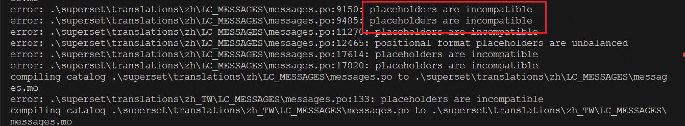
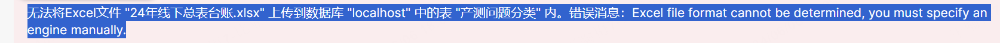

简单汉化

1、编辑/usr/python-3.6.4/lib/python3.6/site-packages/superset目录下的config.py

Babel config for translations处更改为：

# ---------------------------------------------------

# Babel config for translations

# ---------------------------------------------------

# Setup default language

BABEL_DEFAULT_LOCALE = 'zh'

# Your application default translation path

BABEL_DEFAULT_FOLDER = 'babel/translations'

# The allowed translation for you app

LANGUAGES = {

'en': {'flag': 'us', 'name': 'English'},

'it': {'flag': 'it', 'name': 'Italian'},

'fr': {'flag': 'fr', 'name': 'French'},

'zh': {'flag': 'cn', 'name': 'Chinese'},
}

1.2下载superset语言文件

https://github.com/AmberCa/incubator-superset/blob/master/superset/translations/zh/LC_MESSAGES/messages.po

下载完成后，将文件放在下面的目录下

/usr/python-3.6.4/lib/python3.6/site-packages/flask_appbuilder/translations/zh/LC_MESSAGES/messages.po

1.3编译messages.po文件

pybabel compile -d /usr/python-3.6.4/lib/python3.6/site-packages/flask_appbuilder/translations

1.4重启superset，简单汉化完成。

2深度汉化

Go to top directory of superset directory.
(venv) [root@centos4 site-packages]# pwd
/root/Dev/Superset/venv/lib/python2.7/site-packages
Modify babel.cfg to add static for js/jsx path, OTHERWISE "fabmanager babel-extract" will NOT extract the messages for translation in js/jsx files.

babel.cfg配置路径在项目根目录下superset/translations/babel.cfg

在这里声明哪些文件需要提取翻译字符id。

A big question, why there is NO static in the github repo?
Without the static in https://github.com/apache/incubator-superset/blob/master/superset/translations/babel.cfg, how could the messages in js/jsx be extracted?
Could you please help answer?

(venv) [root@centos4 translations]# cat babel.cfg
[ignore: superset/assets/node_modules/**]
[python: superset/**.py]
[jinja2: superset/**/templates/**.html]
[javascript: superset/static/assets/javascripts/**.js]
[javascript: superset/static/assets/javascripts/**.jsx]
[javascript: superset/static/assets/visualizations/**.js]
[javascript: superset/static/assets/visualizations/**.jsx]
encoding = utf-8

Extract the messages marked for translation

提取信息：
(venv) [root@centos4 site-packages]# fabmanager babel-extract --target superset/translations/ --output superset/translations/messages.pot --config superset/translations/babel.cfg -k _ -k __ -k t -k tn -k tct
Compile and generate json file.
(venv) [root@centos4 site-packages]# fabmanager babel-compile --target superset/translations/

编译命令：writing PO template file to superset/translations/messages.pot
安装包，将po转换为json:

npm install po2json -g

babel.cfg中标记的文件提取到一个综合的.mo->po（PO模板文件）->pot()->json

writing PO template file to superset/translations/messages.pot
(venv) [root@centos4 site-packages]# /opt/node-v8.11.1-linux-x64/bin/po2json -d superset -f jed1.x superset/translations/zh/LC_MESSAGES/messages.po superset/translations/zh/LC_MESSAGES/messages.json
(venv) [root@centos4 site-packages]# po2json -d superset -f jed1.x superset/translations/zh/LC_MESSAGES/messages.po
Restart Superset and select Chinese locale.

---

xset上传Excel文件失败：

