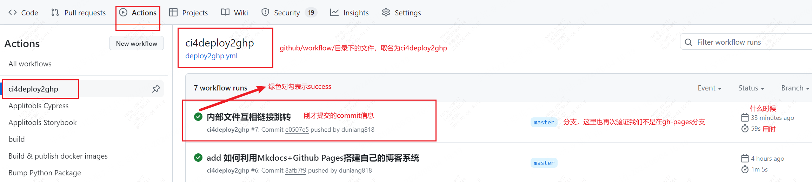
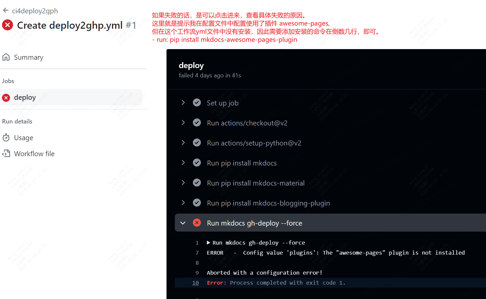

<< [[2024-06-03]] | [[2024-06-05]] >>

# 1 每日一句

> [!quote] If you change the way you look at things, the things you look at change.
> — Wayne Dyer

# 2 文章主旨

因为GitHub Pages采用 [GitHub Actions](https://github.com/features/actions)作为工作流，因此可以借助其强大的CI/CD功能，形成一键部署的目的。你只管写文章，其它的交给工具和平台就好了。

1. 在mkdocs的根目录下创建 .github/workflows/ci.yml 一个文件，自己可以随意取名，但格式必须是 yml。
2. 示例，首先以简单为主，达到自动化目的，后面再慢慢研究增多。

```yml
name: ci4deploy2ghp

on:

  push:

    branches:

      - master

jobs:

  deploy:

    runs-on: ubuntu-latest

    steps:

      - uses: actions/checkout@v2

        with:  # mkdocs-blogging-plugin 给出的渲染问题解决方案

          fetch-depth: 0

      - uses: actions/setup-python@v2

        with:

          python-version: 3.x

      - run: pip install mkdocs  # 在线环境中安装依赖包

      - run: pip install mkdocs-material

      - run: pip install mkdocs-blogging-plugin  # 记得安装其他依赖的库

      - run: pip install mkdocs-awesome-pages-plugin

      - run: pip install mkdocs-git-revision-date-localized-plugin

      - run: mkdocs gh-deploy --force
```

3. ok，上面一个的workflow文件就建立好了。现在可以在本地运行 git push origin master 看看效果了。
4. 到GitHub Actions看看workflow运行的状况。这里可以看见是否成功，失败，哪些workflow运行了，还可以重新运行等操作。


