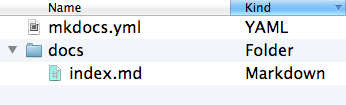
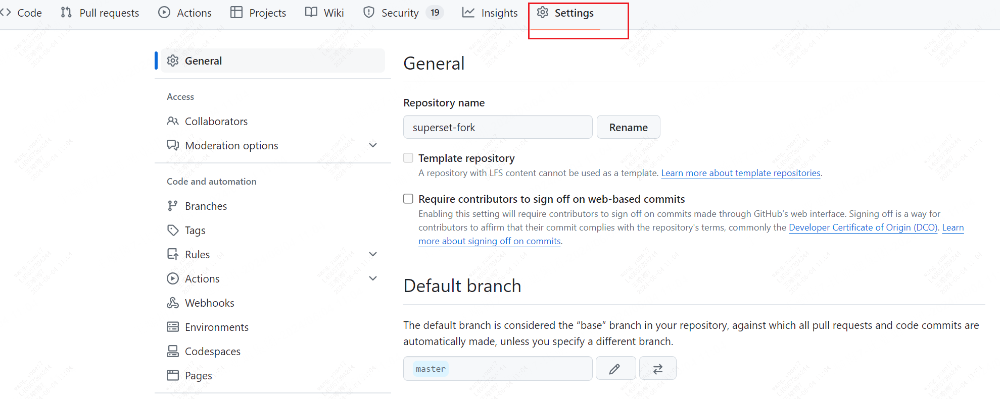
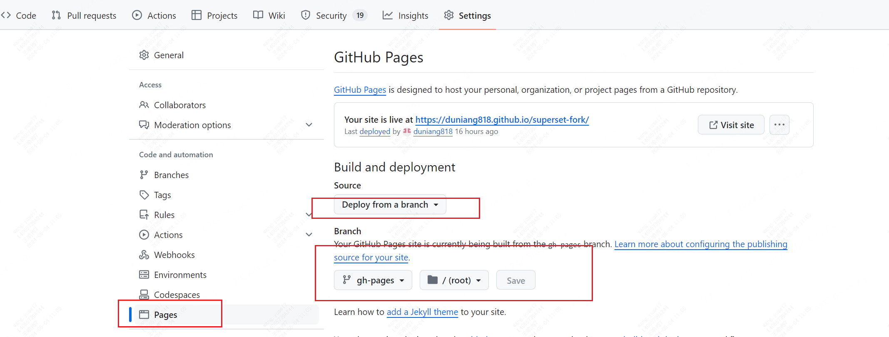

<< [[2024-06-03]] | [[2024-06-05]] >>

# 1 每日一句

> [!quote] Technology… is a queer thing. It brings you great gifts with one hand, and it stabs you in the back with the other.
> — Carrie Snow

在网上看见别人发表自己的文章，是不是非常羡慕，不仅撰写的内容非常的高质量，吸引人，而且他们的博客系统非常的美观且使用方便流畅？那么你是否也想时不时分享一些属于自己的内容给其他人呢？获得一丝丝的点赞和反馈呢？亦或在随着时间的流逝，在这个有记忆的互联网留下自己的足迹呢？
我自己一直苦于这样的事情，但是一直没有找到办法，之前以为是要付费，或者需要前端开发经验，硬是把自己劝退无数次。
但心底的呼声一旦发出，就时不时的会提醒你，这件事还没有做呢，这件事还没有做呢，到底还做不做，什么时候做？
在经过一年的笔记软件使用和乱七八糟的编写经历后，发现博客系统原来是可以这么搭建起来的。
好吧，开始动手干吧。

# 2 选择 Mkdocs

mkdocs 是静态网站生成工具， [**mkdocs官网**](https://www.mkdocs.org/)。
material for mkdocs 是基于mkdocs网站的一套漂亮主题模板。
为何选择这个：

- python编写
- 安装简单
- 有个模板主题非常漂亮，[Material for MkDocs (squidfunk.github.io)](https://squidfunk.github.io/mkdocs-material/)
- markdown文档支持
- ok，有上面的四点已经满足我的需求了。也了解过 [Docusaurus](https://docusaurus.io/docs)，因为 superset doc 是用这个搭建的。但 docusaurus 它是利用前端来搭建的，安装就需要 npm 这样的工具，而且它是单页面静态网页应用，所以劝退了，最终选择了 **Mkdocs** 。
- 也可以参考 [网站生成工具比较](/docs/blog/posts/网站生成工具比较.md)

# 3 安装 Mkdocs

安装 mkdocs ，material包：

```powershell
pip install mkdocs mkdocs-material
```

创建博客新项目：

```powershell
mkdocs new yourfirst_blog_project
```

进入目录查看项目结构，这是最简单的一个项目结构： `cd yourfirst_blog_project`



mkdocs.yml: 全局配置文件，非常重要

docs: 文档根目录，存放文档源文件的地方，也是 **docs_dir** 配置参数的默认路径。

index.md: 博客系统的入口文档

在mkdocs.yml的相同目录（博客根目录）运行命令，根据输出地址 [http://127.0.0.1:8000/](https://127.0.0.1:8000) 在本地浏览器上查看效果：

```powershell
mkdocs serve
```

至此经过三步就已经在本地成功的搭建起自己的博客系统了，是不是 super easy ！！！

# 4 部署到 Github Pages

1. 首先在GitHub上新建一个repo，并且是public的，因为无论仓库是private还是public，Github Pages 都是向整个互联网公开的。
2. 在编辑器软件里，git clone 刚才建立的库到本地。
3. 进到项目里面，把刚才安装的mkdocs三个重要文件手动复制到这里，或者在这个空仓库里重新运行创建博客的命令，在这里新建博客项目，效果一样。
4. git add .
5. git commit -m 'init blog system with mkdocs'
6. git push origin master
   已经在本地的博客项目与GitHub 仓库链接起来了，但是此时我们还没有配置 Github Pages 页面，是无法通过网址访问到我们的博客系统的。

# 5 设置 Github Pages

点击仓库的 setting，其它设置默认就好了，不需要进行修改。



下面是我们要修改的地方。


注意，只需要点击和修改红框的地方。gh-pages 不是我们建立的分支，是 mkdocs 在编译运行前会自动创建的分支，也同样会自动将博客编译后的 site 文件夹原封不动的复制到 gh-pages。
如果等待十分钟后，还是没有在如你用户名的 https://xxxxxx.github.io/superset-fork/ 网址看见你的初始化博客，请反复设置和确认上图的步骤和内容，尤其是 deploy from a branch,  gh-pages /。

# 6 如何在已有项目设置使用 Mkdocs

其实这个非常简单。无论是GitHub已有仓库，还是本地已有的任何项目，只有在相应的路径下运行
mkdocs new .
这个命令就好了，核心就是确保 有 docs, index.md, mkdocs.yml 这三剑客就ok了。
比如 docs 目录已经存在，index.md文件存在 都没有关系，只要你相对位置ok就好了。
现在同样在 mkdocs.yml 文件同级目录下运行：
mkdocs serve
本地就跑起来了。
如果之前在GitHub上已经为此项目设置了 pages，那你可以取舍一下。如果没有设置 pages，那刚好可以为这个项目设置 pages。因为GitHub Pages 是支持每个项目设置自己的 Pages 的。
简直是太优秀了，现在可以愉快的写文章了。
看着整洁的博客系统，优美的界面，觉得自己瞬间写文章的动力也增加了不少，而且也要求自己的文章布局和结构优美，用最好的框架组织内容，最少的语言表达最丰富的内容。毕竟字少干货多谁不喜欢呢？

# 7 在本地实时渲染和修改博客

搭建好后，可以在本地可以一边修改一边及时在浏览器网页端查看效果呢。体验真的 very happy。

这样可以及时修改不对的地方，发现换行不对，图片不对，错别字等，实时写博客真的 very high，提高了写作的流畅和兴趣感。写的效果和最终看见的效果及时达成一致了。
