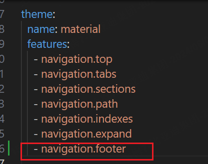

# 1 每日一句

> [!quote] There is no greater harm than that of time wasted.
> — Michelangelo

# 2 文章主旨

- [X]  附件如何存放附件， 且在当前目录下设置附件目录 [obsidian工具](tools/obsidian.md) ✅ 2024-06-04
- [X]  如何添加上一篇，下一篇按钮并关联文章

- [X]  内部文章之间如何跳转: 用Markdown[链接](https://daringfireball.net/projects/markdown/syntax#link)语法就ok: * 一对方括号[]跟着一对小括号()*。[当前显示的名称](目标文章的相对路径+扩展名一起)
- [ ]  设置代码块复制按钮

## 2.1 Navigation tabs

导航页签：把section节单独显示在一个页面。
好处是在让左侧边栏显示减少，简洁，便于查看。

## 2.2 Navigation sections

导航节：顶层节会分组显示在左侧边栏的视窗

## 自动导航
